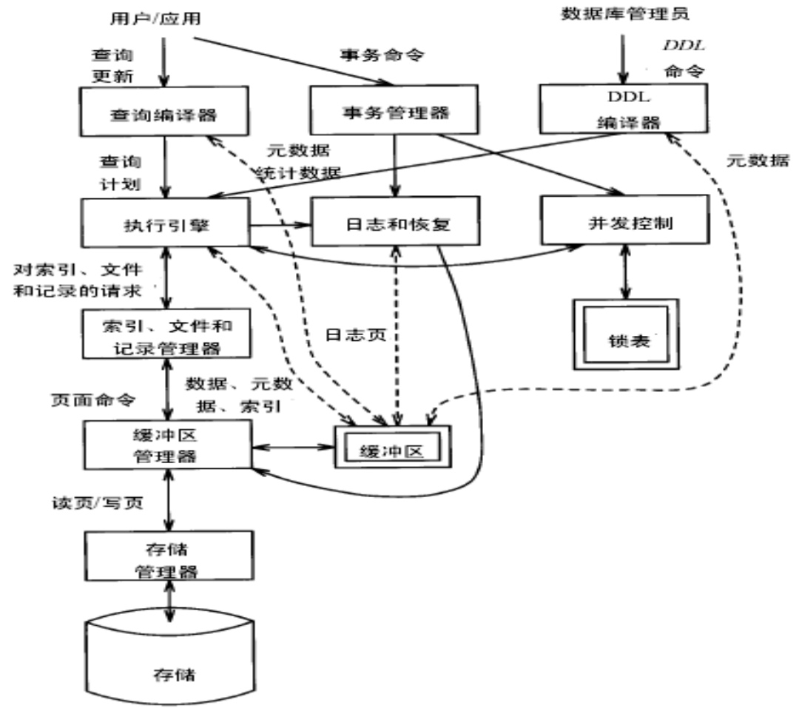

## 前言

在计算机领域，各部分知识相互关联，因此，对计算机系统、操作系统、编译原理以及软件工程等内容的理解，都将加深对数据库系统的认识，反之亦然。这种认识通常醍醐灌顶一般。

当单独学习某一门课程，尤其首次学习时，往往难以突破知识间的壁垒，与其他部分的知识联系。我们就像装在套子里的人，学习也逐渐变成了记忆、背诵和应试。新的理解往往需要大量的阅览和总结，这也是非常困难的。

该仓库关于[高级数据库系统](#综览)，包括经典数据库系统结构和大数据存储与管理技术，另外，还实现了一个[存储与缓冲管理器](#存储与缓冲管理器)。

希望大家在一点一滴的积累中，共勉！

[TOC]

## 存储与缓冲管理器

…

## 综览

[^高级数据库系统]: [标签: 数据库 | LiJT的灵质空间](https://cslijt.github.io/LiJT-Daily/tags/数据库/)
[^存储器层次结构]: [【深入理解计算机系统CSAPP】第六章 存储器层次结构 - huilinmumu - 博客园](https://www.cnblogs.com/huilinmumu/p/16286735.html)
[^文件系统]: [文件系统全家桶 | 小林coding](https://www.xiaolincoding.com/os/6_file_system/file_system.html)
[^页与块]: [为什么要有虚拟内存？ | 小林coding](https://www.xiaolincoding.com/os/3_memory/vmem.html)
[^搜索树]: [MySQL之B+树分析 - zhzcc - 博客园](https://www.cnblogs.com/zhzcc/p/18454042)
[^树平衡]: [【数据结构与算法】手撕平衡二叉树 - gonghr - 博客园](https://www.cnblogs.com/gonghr/p/16064797.html)
[^B+树]: [MySQL B+树 BTree原理、增删改（详细）_mysql 带演示b+树增删改、-CSDN博客](https://blog.csdn.net/weixin_43162044/article/details/127455840)

### 经典数据库系统结构

<table>
  <tr>
    <td align=center></td>
  </tr>
</table>

- [基本概念](./doc/基本概念.md)
- [数据存储](./doc/数据存储.md)[^存储器层次结构]
- [数据表述](./doc/数据表述.md)[^文件系统][^页与块]
- [缓冲区管理](./doc/缓冲区管理.md)
- [索引结构](./doc/索引结构.md)[^搜索树][^树平衡][^B+树]

### 大数据存储与管理技术

<table>
  <tr>
    <td align=center></td>
  </tr>
</table>

- 查询处理
- 事务处理
- SQL vs NoSQL/NEWSQL
- 系统架构
- 存储技术
- 高可用、高吞吐、高扩展技术

