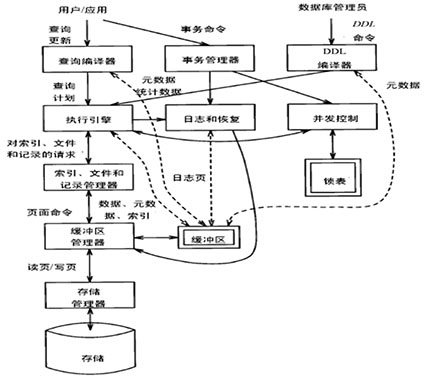

## 前言

在计算机领域，各部分知识相互关联，因此，对计算机系统、操作系统、编译原理以及软件工程等内容的理解，都将加深对数据库系统的认识，反之亦然。这种认识通常是醍醐灌顶的。

当单独学习某一门课程，尤其首次学习时，往往难以突破知识间的壁垒，与其他部分的知识联系。我们就像装在套子里的人，学习也逐渐变成了记忆、背诵和应试。新的理解往往需要大量的阅览和总结，这也是非常困难的。

该仓库关于[数据库管理系统结构](#数据库管理系统结构)，参考[Peiquan Jin (2024). *Advanced Database Systems* [Lecture notes]. ustc.](https://kdelab.ustc.edu.cn/~jpq/courses/adb-cs.html)、[Guoliang Li (2024). *Database Management System* [Lecture notes].  Tsinghua](https://dbgroup.cs.tsinghua.edu.cn/ligl/courses.html)，基于这种了解，实现了一个[存储与缓冲管理器](#存储与缓冲管理器)。

总之，希望大家在一点一滴的积累中成为更好的程序猿，共勉！

## 存储与缓冲管理器

> [report](./code/report.md) for details

- Buffer and Frames
- File Storage
- Page Replacement Algorithm
- Multi-Threads
- Concurrency Control

## 数据库管理系统结构

<table>
  <tr>
    <td align=center></td>
  </tr>
</table>

- [数据库系统概论](./doc/数据库系统概论.md)
- [数据存储](./doc/数据存储.md)[^存储器层次结构]
  - [数据表述](./doc/数据表述.md)[^文件系统][^页与块]
  - [缓冲区管理](./doc/缓冲区管理.md)
  - [索引结构](./doc/索引结构.md)[^搜索树][^树平衡][^B+树][^动态hash][^R-Tree][^多维索引]

- [查询处理](./doc/查询处理.md)

------

[^存储器层次结构]: [【深入理解计算机系统CSAPP】第六章 存储器层次结构 - huilinmumu - 博客园](https://www.cnblogs.com/huilinmumu/p/16286735.html)
[^文件系统]: [文件系统全家桶 | 小林coding](https://www.xiaolincoding.com/os/6_file_system/file_system.html)
[^页与块]: [为什么要有虚拟内存？ | 小林coding](https://www.xiaolincoding.com/os/3_memory/vmem.html)
[^搜索树]: [MySQL之B+树分析 - zhzcc - 博客园](https://www.cnblogs.com/zhzcc/p/18454042)
[^树平衡]: [【数据结构与算法】手撕平衡二叉树 - gonghr - 博客园](https://www.cnblogs.com/gonghr/p/16064797.html)
[^B+树]: [MySQL B+树 BTree原理、增删改（详细）_mysql 带演示b+树增删改、-CSDN博客](https://blog.csdn.net/weixin_43162044/article/details/127455840)
[^动态hash]: [【转】动态hash方法（数据库索引技术） - Gwa - 博客园](https://www.cnblogs.com/kegeyang/archive/2012/04/05/2432608.html)
[^R-Tree]: [空间数据索引RTree完全解析及Java实现_rtree索引-CSDN博客](https://blog.csdn.net/MongChia1993/article/details/69941783)

[^多维索引]: [【高级数据库】第二章 第04讲 多维索引-CSDN博客](https://blog.csdn.net/qq_36426650/article/details/103324224)

