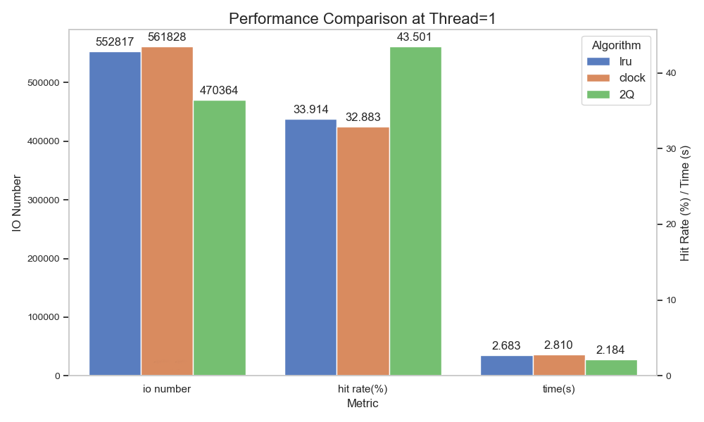
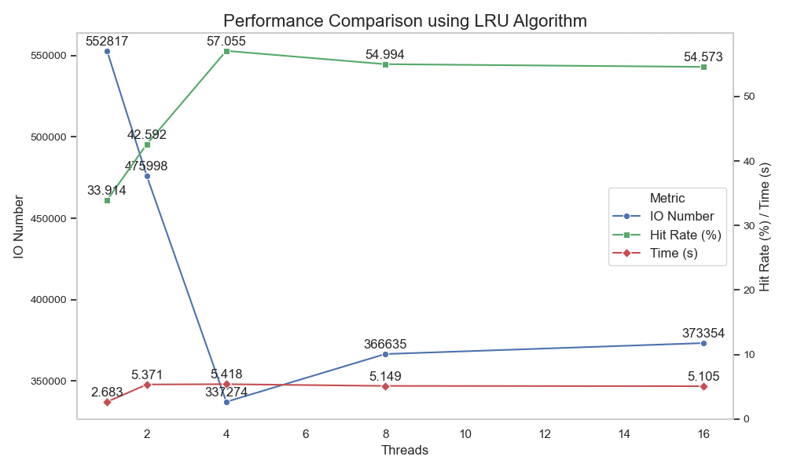

# Storage and Buffer Manager Lab Report

> <center style="font-size: small;  margin-top: 0;">
>     <a href="https://github.com/biglonglong/Storage-and-Buffer-Manager-of-Advanced-Database">biglonglong</a>，Electronic and Information Engineering，USTC
> </center>


<center>
    <strong>For “Advanced Database Systems”</strong><br>
    <strong>2024</strong>
</center>


## Table of Contents

[TOC]


## Abstract 

设计具体要求：[adbs-lab.pdf](./refer/adbs-lab.pdf)。在本项目中，biglonglong 实现了一个简单的存储和缓冲管理器。本文将陈述其设计和实现结果，包括缓存与帧、哈希技术（BCB）、存储管理器、缓存管理器、几种页面替换算法、多线程、并发控制等。 

- [x] 按文档要求实现Storage and Buffer Manager，实现LRU算法。
- [x] 底层文件采用目录式堆文件。
- [x] 构建了一个5万个page（页号从0到49999）的堆文件（使用自己实现的FixNewPage()接口），然后再运行trace文件：[data-5w-50w-zipf.txt](./refer/data-5w-50w-zipf.rar)（包含了50万次满足Zipfan分布-0.8的页面请求，即80%的请求集中在前20%的页号上），根据设计文档要求统计磁盘IO、Buffer命中率、运行时间等数据。
- [x] 实现CLOCK、2Q缓存置换算法，并与LRU算法的性能进行对比；
- [x] 加入缓存请求时的并发控制，通过乐观内存锁(latch)解决缓存访问时的冲突；通过多线程方式执行trace并给出测试结果。


## Works

### Buffer and Frames

**存储结构及其大小**：缓冲区指的是主存中的空间，CPU 只能访问主内存中的内容。缓冲区由帧数组组成。当请求一个页面时，它就会被加载到缓冲区的内存中。大多数商业数据库管理系统都规定帧的大小与页的大小相同，以防止外部碎片。本项目也采用了同样的策略。项目的缓冲区大小默认设置为 1024，页大小固定为4KB，帧大小也为4KB。该结构定义如下：

```cpp
// Buffer.h
#define DEFBUFSIZE 1024
#define FRAMESIZE 4096
#define PAGESIZE 4096
struct bFrame
{
    char field[FRAMESIZE];
};

//...
bFrame buf[DEFBUFSIZE];
```

#### Hashing Technique

**缓冲区控制块（ BCB）**：缓冲区中的每个帧都必须保留一个缓冲区控制块（ BCB），每个 BCB 都包含一个 page_id、frame_id、page_latch、fix_count 和 dirty_bit。page_ids 用作散列函数的密钥，去映射到 BCB。必须保留两个哈希表：一个用于将 page_ids 映射到 frame_ids 和 BCB，另一个用于将 frame_ids 映射到 page_ids。使用简单的静态散列技术，在静态散列中，桶的数量是固定的。如果数据桶已满，则会为额外的数据项连接溢出链。在单个数据桶内进行搜索时，会使用顺序搜索。随着时间的推移，桶的数量不会发生变化。散列函数如下：
$$
H(k) = page\_id\ \% \ buffer\_size
$$
page_id 到 BCB 的哈希表`BCB hTable[BufferSize]`，从 frame_id 到 page_id 的哈希表int hTable[BufferSize]。删除BCB.page_latch，使用Cpp`#include <mutex>`解决缓存访问时的冲突

```cpp
// Buffer.h
typedef int frame_id_t;
typedef int page_id_t;

struct BCB
{
    int page_id;
    int frame_id;
    // int latex;
    int count;
    int dirty;
    BCB *next;

    BCB() : page_id(-1), frame_id(-1), count(0),
            dirty(0), next(nullptr){};
    BCB(int pid, int fid) : page_id(pid), frame_id(fid), count(1),
                            dirty(0), next(nullptr){};
};
```

### File Storage

**Data Storage Manager**：管理磁盘I/O，当前数据文件将保存在 DSManager 类中，该文件命名为data.dbf。数据存储采用目录式堆文件结构。记录无序，插入数据到文件尾部，删除数据时标记页面。当数据块已满时，使用标记的页面存储新记录。

```cpp
// DataStoreManager.h
#include "Buffer.h"
#define MAXPAGES 50000
class DSMgr
{
public:
    DSMgr(string filename);
    ~DSMgr();

    int OpenFile(string filename);
    int CloseFile();
    bFrame ReadPage(int page_id);
    int WritePage(int page_id, const bFrame &frm);
    page_id_t NewPage();
    int Seek(int offset, int pos);
    FILE *GetFile();
    void IncNumPages();
    int GetNumPages();
    void SetUse(int index, int use_bit);
    int GetUse(int index);

private:
    FILE *curr_file_;
    int num_pages_;
    int pages_table_[MAXPAGES];
};
```

- `OpenFile(string filename)`：OpenFile 函数在需要打开文件进行读写时被调用。 该函数的原型是 OpenFile(String filename)，并返回一个错误代码。 该函数将打开文件名指定的文件。
- `CloseFile()`：当需要关闭数据文件时，将调用 CloseFile 函数。其原型为 CloseFile()，并返回错误代码。只有在更改数据库或关闭程序时才调用该函数。
- `ReadPage(int page_id)`：缓冲区管理器中的 FixPage 函数会调用 ReadPage 函数。该函数的原型是 ReadPage(page_id,bytes)，并返回读入的内容。该函数调用  fread() 从文件中获取数据。
- `WritePage(int frame_id, bFrame frm)`：每当从缓冲区中取出一个页面时，就会调用 WritePage 函数。其 原型为 WritePage(frame_id,frm)，并返回写入的字节数。该 函数调用 fwrite() 将数据保存到文件中。
- `Seek(int offset, int pos)`：Seek 函数移动文件指针。
- `GetFile()`：GetFile 函数返回当前文件。
- `IncNumPages()`：IncNumPages 函数将页面计数器的页数递增。
- `GetNumPages()`：GetNumPages 函数返回页数。
- `SetUse(int page_id, int use_bit)`：SetUse 函数用于设置页面数组中的位。该数组记录了正在使用的页面。如果一个页面中的所有记录都被删除，那么该页面就不再被使用，可以在数据库中再次使用。为了确定页面是否可重复使用，需要检查数组中是否有任何 use_bits 设置为 0 的页面。
  - `NewPage()`：NewPage()是为了满足 buffer manager 中 FixNewPage 函数的需求。优先分配空闲页面，次而根据 pages_table_ 数组分配已被删除页面，否则返回错误信号。
- `GetUse(int page_id)`：GetUse 函数返回相应页码的当前使用位。

**Buffer Manager**：管理缓存分配，实现页面请求、帧替换等。

```cpp
// BufferManager.h
#include "Buffer.h"
#define DEFBUFSIZE 1024
#include "DataStoreManager.h"
#include "ReplacePolicies.h"
class BMgr
{
private:
    bFrame buffer_pool_[DEFBUFSIZE]; // buffer pool
    int fid_to_pid_[DEFBUFSIZE];     // Hash Table: frame_id to page_id
    BCB *pid_to_bcb_[DEFBUFSIZE];    // Hash Table: page_id to BCB

    ReplaceAlg *replace_alg_;
    DSMgr *disk_manager_;
    int num_io_;
    int num_hits_;
    mutex latch_;

    // frame
    frame_id_t NewFrame();
    frame_id_t SelectVictim();
    int Hash(int page_id);
    void PrintFrame(int frame_id);
    // page and BCB
    BCB *LoadPage(int page_id, int frame_id);
    bool DeletePage(int frame_id);
    BCB *CreateBCB(int page_id, int frame_id);
    bool RemoveBCB(int frame_id);
    BCB *SearchBCB(int frame_id);
    BCB *SearchPage(int page_id);
    // operation
    void SetDirty(int frame_id);
    void UnsetDirty(int frame_id);
    void WriteDirtys();
    // other
    bool FlushPage(int page_id);
    bool _is_Valid_Page(int page_id);

public:
    BMgr(string filename, int alg = Policy::Lru);
    ~BMgr();
	
    // interface
    frame_id_t FixPage(int page_id, int op_type);
    frame_id_t FixNewPage(int &page_id);
    frame_id_t UnfixPage(int page_id);

    int NumFreeFrames();
    int GetIONum() { return num_io_; }
    int GetHitNum() { return num_hits_; }
    int GetNumPages() { return disk_manager_->GetNumPages(); }
};
```

- `FixPage(int page_id, int prot)`：该函数的原型是 FixPage(Page_id,prot)，它返回一个 frame_id。文件和访问管理器将使用记录的 record_id 中的 page_id 调用该页面。该函数会查看页面是否已在缓冲区中，如果是，则返回相应的 frame_id。如果缓冲区中还没有该页面，它将根据需要选择一个受害页面，并加载所请求的页面。
- `FixNewPage()`：该函数的原型是 FixNewPage()，它返回一个 page_id 和一个 frame_id。当插入、索引拆分或对象创建时需要一个新页面时，就会使用该函数。创建对象时使用。返回的 page_id 将分配给 record_id 和元数据。该函数将找到一个空页面，文件和访问管理器可以用它来存储一些数据。
- `UnfixPage(int page_id)`：该函数的原型是 UnfixPage(page_id)，它返回一个 frame_id。该函数是对 FixPage 或 FixNewPage 调用的补充。该函数将递减帧上的固定计数。如果计数减至零，则页面上的锁存会被移除，如果选择了帧，则可以移除帧。page_id 将被转换为 frame_id，如果页面上的计数已降为零，该页面可能会被解除锁定，从而被选为受害页面。
- `NumFreeFrames()`：函数 NumFreeFrames 会查看缓冲区，并返回可用的缓冲区页数。这对查询处理器的 N 路排序特别有用。函数的原型与 NumFreeFrames() 类似，并返回一个从 0 到 BUFFERSIZE-1(1023) 的整数
- `SelectVictim()`：SelectVictim 功能选择要替换的帧。如果所选帧的脏位被设置，则需要将页面写入磁盘。
- `Hash(int page_id)`：Hash 函数将 page_id 作为参数，并返回 frame_id。
- `CreateBCB(int page_id, int frame_id)`：在调入页面时调用该函数以创建BCB，初始化并将其加入到哈希表中
- `RemoveBCB(BCB* ptr, int page_id)`：RemoveBCB 函数用于从数组中删除 page_id 的缓冲控制块。只有在 SelectVictim() 函数需要替换帧时才会调用该函数。
- `SearchBCB(int frame_id) `：根据已存在的frame_id查找记录访问控制信息的BCB地址
- `SearchPage(int page_id) `：根据页号查找页面是否在内存中，如果已调入内存则返回BCB，否则返回NULL
- `SetDirty(int frame_id)`：SetDirty 函数用于设置 frame_id 的 dirty 位。该 dirty 位用于确定是否写出帧。如果帧的内容被以任何方式修改，则必须写入。这包括任何目录页和数据页。如果该位为 1，则将写入。如果该位为 0，则不会写入。
- `UnsetDirty(int frame_id)`：UnsetDirty 函数将相应 frame_id 的 dirty_bit 赋值为零。调用该函数的主要原因是，setDirty() 函数已被调用，但页面实际上是临时关系的一部分。在这种情况下，页面实际上不需要被写入，因为它不想被保存。
- `WriteDirtys()`：系统关闭时必须调用 WriteDirtys 函数。该函数的目的是写出缓冲区中仍有可能需要写入的页面。只有当 dirty_bit 为 1 时，该函数才会将页面写入文件。
- `LoadPage(int page_id, int frame_id)`：实现调入页面功能。步骤为：调用磁盘读入页面功能，返回页面数据后将数据写入缓存区，创建BCB
- `DeletePage(int frame_id)`： 实现从缓存区移除页面功能。首先查找页面BCB，如果页面不存在或者正在被访问则返回；如果页面存在，则检查修改位，如果被修改则将其写回磁盘，之后删除BCB并返回。
- `PrintFrame(int frame_id)`：PrintFrame 函数会打印出 frame_id 所描述的帧的内容。


### Page Replacement Algorithm

为方便实现多种替换算法，将所有页面替换算法抽象为一个父类供buffer maneger使用。利用多态特性，将父类指向不同的子类，实现不同的页面替换算法，如下：

```cpp
//Buffer.h
class ReplaceAlg
{
public:
    ReplaceAlg() = default;
    virtual ~ReplaceAlg() = default;
    /* Pin the victim frame as defined by the replacement policy. */
    virtual frame_id_t Victim() = 0;
    /* Pins a frame, indicating that it should not be victimized until it is unpinned. */
    virtual void Pin(int frame_id) = 0;
    /* Unpins a frame, indicating that it can now be victimized. */
    virtual void Unpin(int frame_id) = 0;
};
```

#### LRU

为了高效存储和管理最近访问的页号，我们需要一个数据结构来支持频繁的插入和删除操作，特别是头插和尾删操作。综合考虑，使用**哈希表+双向链表**的组合是比较合适的。

1. 双向链表：
   - 插入和删除操作：双向链表允许我们在常数时间内进行插入和删除操作，特别是头插和尾删操作。这对于维护最近访问的页号非常重要，因为我们需要频繁地将最近访问的页面移到链表头部，并在缓存满时从链表尾部移除最久未使用的页面。
   - 维护访问顺序：双向链表可以按照从最近使用到最久未使用的顺序维护页面。当我们访问或更新一个页面时，可以将其移动到链表头部；当需要置换页面时，可以从链表尾部移除页面。
2. 哈希表：
   - 快速查找：哈希表允许我们在常数时间内查找某个页面是否在缓存中。这对于判断页面是否命中缓存非常重要。
   - 快速定位：哈希表可以将页号映射到双向链表中的节点位置，从而在常数时间内定位到页面在链表中的位置，方便进行删除和移动操作。

这种**哈希表+双向链表**的组合使得查找、删除和插入操作的时间复杂度都为O(1)，非常高效。

```cpp
class LPUReplaceAlg : public ReplaceAlg
{
    struct ListNode // 双向链表节点
    {
        int frame_id;
        ListNode *prev, *next;

        ListNode(int v = -1) : frame_id(v), prev(nullptr), next(nullptr) {}
    };

public:
    LPUReplaceAlg();
    ~LPUReplaceAlg();
    frame_id_t Victim();
    void Pin(int frame_id);
    void Unpin(int frame_id);

private:
    ListNode *fid_to_node_[DEFBUFSIZE]; // hash table : frame_id to Listnode pointer
    ListNode *head_, *tail_;            // 双向链表头尾指针
    mutex latch_;                       // 为了线程安全需要加的锁

    void pop_node();
    void push_node(ListNode *new_node);
    inline void set_pointer(ListNode *p, ListNode *q)
    {
        p->next = q; //
        q->prev = p;
    }
};
```

- `frame_id_t Victim()`: 选择链表的最后一个节点作为替换节点，并将其从链表中删除。如果链表为空，则返回-1。
- `void Pin(int frame_id)`: 表示页面正在被访问。查找该页面是否在链表中，如果存在则将其从链表中移除，表示该页面正在访问，不能被替换。
- `void Unpin(int frame_id)`: 表示页面访问结束。将该节点插入到链表头部。最近访问的页面会保持在链表头部，久未访问的页面会在链表尾部，从而按照淘汰算法被替换。

#### Clock

两个关键设计—**页面访问位**：每个页面都有一个访问位（通常称为"使用位"或"引用位"），用于指示该页面是否最近被访问过。访问位可以是0或1。**时钟指针**：所有页面被组织成一个环形结构，时钟指针指向当前检查的页面。当需要替换页面时，检查时钟指针指向的页面。如果该页面的访问位为0，则选择该页面进行替换，并将新页面放入该位置，同时将时钟指针移动到下一个页面。如果该页面的访问位为1，则将其访问位重置为0，并将时钟指针移动到下一个页面，继续检查下一个页面。这个过程持续进行，直到找到一个访问位为0的页面进行替换。

在具体实现上，维护一个环形链表和一个定位指针`cptr_`，每次从指针处开始循环查找需要被置换的页面。同时，使用哈希表`fid_to_node_`将frame_id映射到链表节点。由于Clock算法比LRU多维护一个**访问位**`ref`，不能简单地将正在访问的页面从链表上删除，否则会丢失访问位信息，访问结束后无法恢复。因此，每个节点添加一个**引用位**`isPin`，用于记录当前页面是否正在被引用。在访问页面时将其标记为`True`，选取victim时跳过正在被引用的页面，确保正在访问的页面不会被替换。

```cpp
class ClockReplaceAlg : public ReplaceAlg
{
    struct ListNode
    {
        int frame_id;
        ListNode *prev, *next;
        bool ref;   // ref 表示当前的 frame 最近是否被使用过
        bool isPin; // isPin 表示当前 frame 是正在被引用

        ListNode(int v = -1) : frame_id(v), prev(nullptr), next(nullptr), ref(false), isPin(true) {}
        // isPin = true 页面加载到 Buffer pool 时，一定是因为 page 被引用了
        // ref = false 因为当前这个 page 的引用还没有结束
    };

public:
    ClockReplaceAlg();
    ~ClockReplaceAlg();
    frame_id_t Victim();
    void Pin(int frame_id);
    void Unpin(int frame_id);

private:
    ListNode *cptr_;                    // clock 指针当前所指位置
    ListNode *fid_to_node_[DEFBUFSIZE]; // hash table: frame_id to node pointer
    mutex latch_;

    bool exists(int frame_id);
    inline void set_pointer(ListNode *p, ListNode *q)
    {
        p->next = q;
        q->prev = p;
    }
};
```

- `frame_id_t Victim()`：
  - 从`cptr_`开始循环查找可以被置换的页面，如果当前页面正在被引用则跳过；
  - 如果当前页面不在被引用且最近未使用，则可以被置换，从链表上取下该节点并返回页号；
  - 每次扫描时将最近使用的页面访问位置为`false`；
  - 如果`cptr_`为`NULL`则返回-1，表示没有可选节点。
- `void Pin(int frame_id)`：表示页面正在被访问。
  - 根据哈希表`fid_to_node_`查找该页面是否在链表中；
  - 如果存在则标记该页面不能被替换，表示页面正在访问。

- `void Unpin(int frame_id)`：表示页面访问结束。
  - 根据哈希表`fid_to_node_`查找该页面是否在链表中；
  - 如果该页面在链表中，则更新访问信息，标记访问位为`true`并取消页面锁定（`isPin=false`）；
  - 如果该页面不在链表中且环上无节点，则创建新节点并将`cptr_`指向该节点；
  - 如果该页面不在链表中且环上有节点，则插入到`cptr_`之后。

#### 2Q

将缓存分为两个队列：一个FIFO队列（A1）和一个LRU队列（Am）。A1队列用于存储刚进入缓存的页面，采用先进先出的策略，过滤短期访问的页面；Am队列用于存储长期访问的页面，采用最近最少使用的策略。页面访问时，若在Am队列中，则移动到队列头部；若在A1队列中，则移至Am队列头部；若不在缓存中，则插入A1队列。缓存满时，优先从A1队列移除页面，若A1队列为空，则从Am队列移除页面。通过这种方式，2Q算法减少了缓存抖动，提高了缓存命中率。

具体来说，维护一个历史队列和一个缓存队列，使用双向链表实现，添加头尾节点便于删除和插入。使用哈希表`fid_to_node_`将[frame_id](vscode-file://vscode-app/d:/Microsoft VS Code/resources/app/out/vs/code/electron-sandbox/workbench/workbench.html)映射到链表节点，便于快速查找和定位。在节点中添加`inCache`字段记录节点是否在缓存队列中。节点中添加`isPin`字段，标记页面是否正在访问，类似于Clock算法。

```cpp
class TwoQReplaceAlg : public ReplaceAlg
{
    struct ListNode
    {
        int frame_id;
        ListNode *prev, *next;
        bool inCache; // 是否在缓存队列中
        bool isPin;    // 是否在访问

        ListNode(int v = -1) : frame_id(v), prev(nullptr), next(nullptr),
                               inCache(false), isPin(true){};
    };

public:
    TwoQReplaceAlg();
    ~TwoQReplaceAlg();
    frame_id_t Victim();
    void Pin(int frame_id);
    void Unpin(int frame_id);

private:
    ListNode *h_head_, *h_tail_;        // history_ list
    ListNode *c_head_, *c_tail_;        // cache_ list
    ListNode *fid_to_node_[DEFBUFSIZE]; // hash table: frame_id to node pointer
    mutex latch_;

    inline void set_pointer(ListNode *p, ListNode *q)
    {
        p->next = q;
        q->prev = p;
    }
    void freeList(ListNode *head);
    void push_node(ListNode *new_node, ListNode *head);
};
```

- `frame_id_t Victim()`：
  - 优先从历史队列尾部查找未被引用的节点，找到则删除并返回；
  - 如果历史队列为空，则从缓存队列尾部查找并淘汰节点；
  - 如果两个队列都为空，则返回-1。
- `void Pin(int frame_id)`：表示页面正在被访问。
  - 根据哈希表`fid_to_node_`查找页面是否在链表中；
  - 如果存在，则标记该页面不能被替换，表示页面正在访问。
- `void Unpin(int frame_id)`：表示页面访问结束。
  - 根据哈希表`fid_to_node_`查找页面是否在链表中；
  - 如果页面未访问过，则插入到历史队列头部，标记访问结束；
  - 如果页面只访问过一次（在历史队列中），则从历史队列移到缓存队列头部；
  - 如果页面访问过多次（在缓存队列中），则从缓存队列移到队列头部。

### Multi-Threads

> OpenMP（Open Multi-Processing）是一个用于多平台共享内存并行编程的API，支持C、C++和Fortran。它通过编译指令、库函数和环境变量来实现并行编程，简化了多线程编程的复杂性。

在我们的项目中，需要执行一个实验来演示结果。跟踪中共有 500,000 个页面引用，这些引用仅限于一组编号在 1 到 50,000 之间的页面。每条跟踪记录的格式为 “x, ###”，其中 x 为 0（读）或 1（写），### 为引用的页码。您需要扫描跟踪文件，并打印出内存和磁盘之间的总 I/O。实验开始时，缓冲区应该是空的。跟踪中涉及的所有 50,000 个页面必须首先在磁盘中具体化，这与基于目录的文件 data.dbf 相对应。

对于本实验，每行输入代表一次页面请求，每个线程模拟一个用户。使用OpenMP多线程可以模拟并发请求，只需在请求循环前添加并行指令。

```cpp
void muti_thread_task(FILE *data_file, BMgr *bmgr, int thread_num)
{
    int op_type;
    int page_id;
#pragma omp parallel for num_threads(thread_num)
    for (int i = 0; i < NUM_PAGR_REQUEST; i++)
    {
        fscanf(data_file, "%d,%d", &op_type, &page_id);
        page_id = page_id % MAXPAGES;
        int frame_id = bmgr->FixPage(page_id, op_type);
        if (frame_id < 0)
            continue;
        bmgr->UnfixPage(page_id);
    }
}
```

### Concurrency Control

`<mutex>`下`std::lock_gurad `是 C++ 标准库中的一种用于管理互斥锁的机制。它的作用是确保在作用域内互斥锁被正确地锁定和解锁，从而实现线程安全。

1. **自动锁定**：创建 lock_guard 对象时，会自动锁定传入的互斥锁（latch_）。
2. **自动解锁**：当 lock_guard 对象超出作用域时，会自动解锁互斥锁。这确保了即使在异常情况下，互斥锁也能被正确解锁，避免死锁。

在任何可能发生冲突的操作之前，如

```cpp
frame_id_t Victim();
void Pin(int frame_id);
void Unpin(int frame_id);

frame_id_t FixPage(int page_id, int op_type);
frame_id_t FixNewPage(int &page_id);
frame_id_t UnfixPage(int page_id);
```

声明

```cpp
mutex latch_; // 定义互斥锁
lock_guard<mutex> lock(latch_); //在函数内使用
```


## Experiments

### Start

| parts       | details                                |
| ----------- | -------------------------------------- |
| CPU         | AMD Ryzen 7 4800H with Radeon Graphics |
| OS          | Ubuntu 22.04.5 LTS                     |
| C/C++编译器 | gcc version 11.4.0                     |

1. 编译

   ```bash
   mkdir build
   cd build/
   cmake .. && make
   ```

2. 运行：为了方便最终的测试，使用了[cmdline](https://github.com/tanakh/cmdline)，

   ```bash
   cd build/
   ./main
   # usage: ./main [options] ... 
   # options:
   #   -p, --policy    replacement policy: [lru|clock|2Q] (string [=lru])
   #   -t, --thread    thread number (int [=1])
   #   -?, --help      print this message
   ```
   
   也可以运行对应的自动化脚本（不推荐），因为很多同学只能在虚拟机上跑，性能可能比较差，很容易出现Segmentation fault (core dumped)，推测大概率是内存太小导致的越界。
   
   ```bash
   chmod +x ./AutoMain.sh
   sh ./AutoMain.sh
   ```
   
   还可以运行对应的可视化脚本
   
   ```bash
   chmod +x ./plot/plot.py
   python ./plot/plot.py
   ```

### Result

实验将在1、2、4、8、16线程下测试 lru、clock、2Q 的 io number、hit rate(%)、  time(s)。io number是指系统从磁盘读取数据或将数据写入磁盘的操作次数；hit rate(%)是指缓存访问请求中有多少比例的请求可以直接从缓存中获取数据，而不需要访问更慢的磁盘，用百分比表示； time(s)即程序的运行时间，一定程度上反映了替换算法的时间复杂度。

下面是部分实验结果：

- thread num：1

| policy | io number | hit rate(%) | time(s) |
| ------ | --------- | ----------- | ------- |
| lru    | 552817    | 33.914      | 2.683   |
| clock  | 561828    | 32.883      | 2.810   |
| 2Q     | 470364    | 43.501      | 2.184   |



从图中可以看出，在单线程条件下，相比另外两种替换算法，2Q算法I/O次数更少，命中率更高，运行时间更短，全方面碾压。

- policy：lru

| thread num | io number | hit rate(%) | time(s) |
| ---------- | --------- | ----------- | ------- |
| 1          | 552817    | 33.914      | 2.683   |
| 2          | 475998    | 42.592      | 5.371   |
| 4          | 337274    | 57.055      | 5.418   |
| 8          | 366635    | 54.994      | 5.149   |
| 16         | 373354    | 54.573      | 5.105   |



从图中可以观察到，采用LRU算法（其他算法亦然），多线程在一定程度上能够提升命中率并减少I/O次数。然而，增加线程数并不总是带来更好的效果，存在一个最佳线程数的阈值。超过该阈值后，性能提升趋于平缓甚至可能下降。

另外，多线程反而会降低程序的运行速度，这很有可能是线程冲突加锁阻塞导致的。


## Reference

- [YMZLT/Adbs-Lab](https://github.com/YMZLT/Adbs-Lab)
- [Lab1 - Buffer Pool Manager](https://aspiring-sovereign-23a.notion.site/Lab1-Buffer-Pool-Manager-848355c2cb584707b8abbcf7356e1c1f)
- [LRU-K和2Q缓存算法介绍](https://www.jianshu.com/p/c4e4d55706ff)
