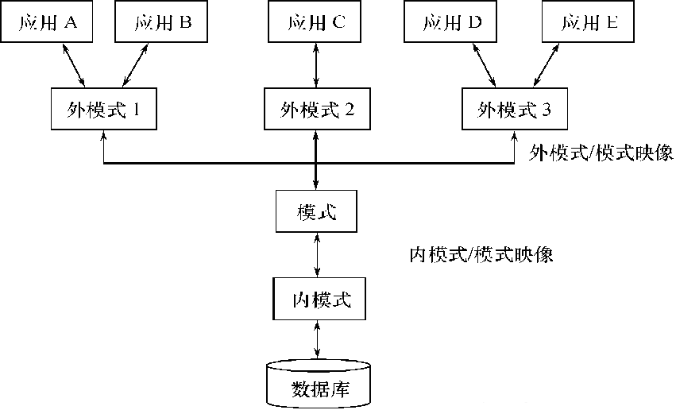

## 基本概念

1. 数据（Data）：人们用来反映客观世界而记录下来的可鉴别的符号，数据库中存储的基本对象，与**语义**对应

2. 数据库（Database）：长期**储存**在计算机内、有**组织**的、可**共享**的大量数据的集合，数据间要求最小的冗余度和较高的独立性（数据库设计问题）

3. 数据库模式（Schema）：数据库中全体数据的逻辑结构和特征的描述

4. 数据库管理系统（DBMS）：位于OS和APP之间的计算机程序的集合，用于高效组织、管理和维护数据库（DBMS实现问题）

5. 数据库系统（DBS）：采用了数据库技术的计算机系统，自下而上分别为数据库 -> 操作系统 -> 数据库管理系统 -> 应用程序开发工具 -> 应用程序 -> 终端用户*n，为上层提供数据库模式、数据和访问控制信息的接口语言（数据库存取问题）

6. 三级模式结构+两级映像：保证数据的逻辑独立性和物理独立性

   

7. 数据模型：现实世界实体、实体间联系以及数据语义和一致性约束的模型，包括数据结构（关系）、数据操作（关系代数）和数据完整性约束（实体完整性、参照完整性、用户自定义完整性），难点在于处理依赖，拆分关系

> 关于关系数据库内容，互联网上比比皆是，下面仅考虑通用DBMS实现问题–存取效率，包括缓冲区管理、查询优化（索引）、并发控制、恢复机制、数据一致性…

