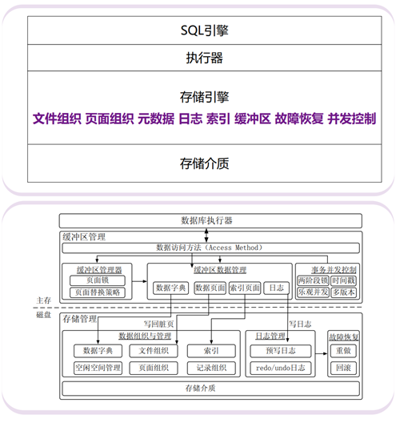
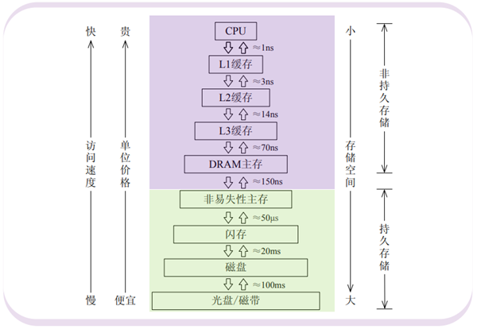
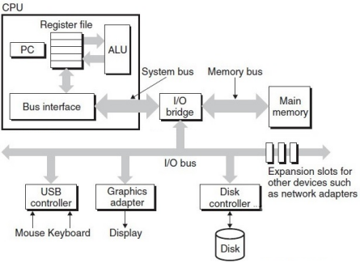
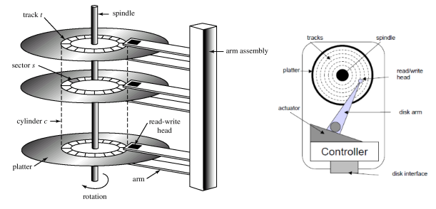

## 数据库中存储部分

## 存储器层次结构

- 寄存器：集成于CPU的触发器，用于暂存指令、数据和地址，以字为单位与缓存交换数据
- L1~3缓存：SRAM，平衡CPU与存储器之间的周期差异，以缓存行为单位与缓存&内存交换数据
- 内存：DRAM，用于存放程序和其处理的数据，以块为单位与磁盘交换数据
- 闪存|磁盘：ROM|磁存储技术，用于存储长期数据，以数据包为单位与服务器交换数据

- 磁盘控制器：磁盘驱动器与计算机接口，控制磁臂实现对磁盘中扇区的读写

## 磁盘结构

- 组成部分：磁臂、双面磁头、双面盘片（扇区、磁道、柱面）、旋转轴
- 扇区：磁盘中数据存储的最小单元（物理）
- 扇区间隙：相邻扇区间的物理间隔，为磁头提供一个缓冲区，供其调整，防止数据读写混淆

## 磁盘块存取时间

块（Block）由若干扇区组成，是OS或DBMS进行磁盘数据存取的最小单元（逻辑）
$$
读块时间Tal（发出块存取请求->块位于主存）=寻道时间S+旋转延迟R+传输时间T+其他延迟other
$$

- 寻道时间：磁头定位到所要柱面所花费的时间，增长率随磁道数衰减，平均情况下有计算公式，其余情况视情境而定
- 旋转延迟：磁盘转动到块的第一个扇区第一个bit到达磁头所需的时间，与磁盘转速V有关，最优情况下0ms，最坏情况下是1/V，平均情况下1/2V
- 传输时间：块的扇区及其间隙旋转通过磁头所需的时间，与块宽度和磁盘转速有关，一般根据磁道与块的比例和磁盘转速换算

- 其他延迟：包括CPU请求IO的时间、争用磁盘控制器时间、征用总线和主存的时间等，典型情况下忽略不计

- 具体情境：
  - 读块时间还要根据磁臂和盘片的相对位置决定，上述说法为随机I/O的情况，如若序列I/O则其寻道时间为0
  - 写块中读入过程的时间计算，如无需校验，则与读块相同；如需校验，则需要再加上1次旋转时间和1次块传输时间
  - 写块除了将块读入主存，还要在主存完成修改并将块重新写入磁盘

> 假设一磁盘参数：3840RPM，块之间间隙占块的10%，每磁道32块，每块8个扇区，那么—>
>
> 读取一个磁道时间=1/3840RPM=15.625ms，15.625 * 90%=14.0325ms用于磁道数据，15.625 * 10%=1.5625ms用于扇区间隙
>
> 读取一个块的时间=15.625/32-1.5625/(32 * 8)=0.482ms（平均每个扇区一个间隙，块读取时最后一个扇区对应间隙不耗时），其中15.625/32 * 90%=0.439ms用于块数据（块之间间隙占块的10%）

## 磁盘块请求性能优化

- 存取时间
  - 随机I/O转为序列I/O，修改多次读写请求的顺序，使之序列化
  - 块大小选择，大块减小I/O次数，但每次I/O时间更长且可能读入无用的数据，小块反之
  - 按柱面组织数据，减少平均寻道时间
- 访问时间：系统发出读写指令后到磁盘开始返回数据的时间
  - 调度，如电梯算法
  - 预取和缓冲，同时进行CPU处理和数据缓冲读入，但要求缓冲区管理、维护一致性
  - 文件组织（磁盘阵列、磁盘镜像），实现并行读写
- 数据传输速率
  - 更好的存储介质，处理器数据处理能力远强于存储器数据供应能力，探寻新型存储—非易失性&高密度&快存取&低功耗|低可靠性&读写不对称
    - 闪存（Flash Memory）：读快写慢、写前擦除、擦除次数有限
    - 相变存储器（Phase Change Memory）：写快读慢、擦除次数有限，相比闪存更持久

