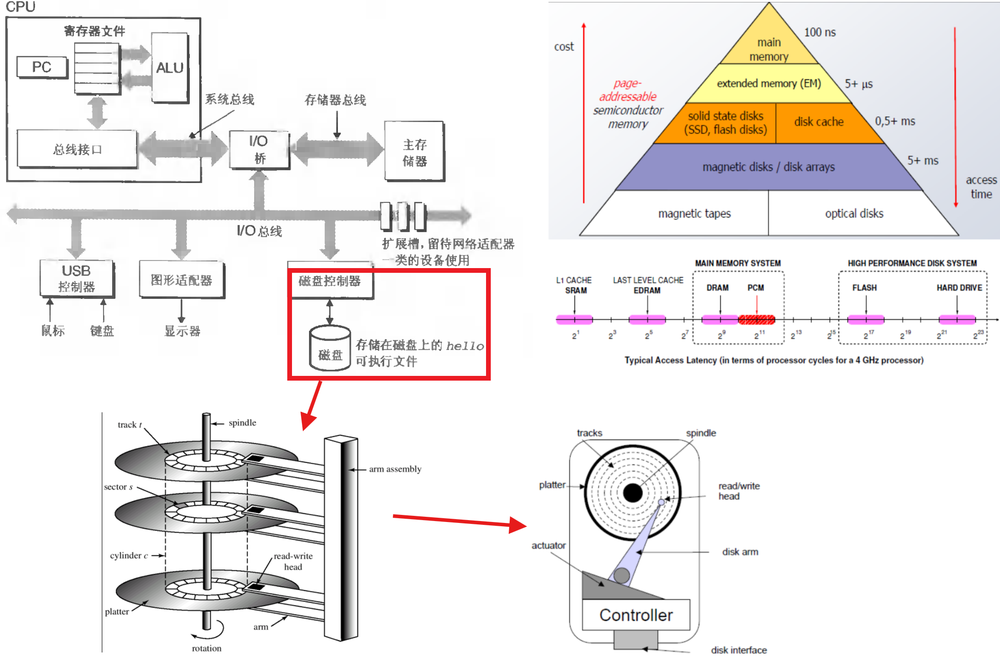

## 存储器结构

<table>
  <tr>
      <td></td>
  </tr>
</table>

- 存储器核心思想：层次化存储
- 扇区是磁盘中数据存储的最小单元（物理）
- 扇区间隙：相邻扇区间的物理间隔，为磁头提供一个缓冲区，供其调整，防止数据读写混淆，提高数据读写的准确性和可靠性

## 磁盘块存取时间

块（Block）由若干扇区组成，是OS或DBMS进行磁盘数据存取的最小单元（逻辑）
$$
读块时间Tal=寻道时间S+旋转延迟R+传输时间T+其他延迟other
$$

- **读块时间计算**仅考虑从”发出块存取请求“到”块位于主存“的时间，不考虑CPU对块的上级读写
- 一般要求计算“最优”、“平均”、“最坏”情况下的读块时间
  - 寻道时间：磁头定位到所要柱面所花费的时间，增长率随磁道数衰减，一般会给出三种情况下的指标（平均情况下有计算公式）
  - 旋转延迟：磁盘转动到块的第一个扇区第一个bit到达磁头所需的时间，与磁盘转速V有关，最优情况下0ms，最坏情况下是1/V，平均情况下1/2V
  - 传输时间：块的扇区及其间隙旋转通过磁头所需的时间，与块宽度和磁盘转速有关，一般根据磁道与块的大小和磁盘转速按比例换算
  - 其他延迟：包括CPU请求IO的时间、争用磁盘控制器时间、征用总线和主存的时间等，典型情况下忽略不计
- 具体读块时间还要根据磁臂和盘片的相对位置决定，上述为随机I/O，如若序列I/O则其寻道时间可为0
- **写块时间计算**：如无需校验，则与读块相同；如需校验，则需要再加上1次旋转时间和1次块传输时间
- **块修改**：将块读入主存；在主存完成修改；将块重新写入磁盘-块地址=<物理设备号,柱面号,盘面号(或磁头号),扇区号>

> 假设一磁盘参数：3840RPM，块之间间隙占块的10%，每磁道32块，每块8个扇区，那么—>
>
> 读取一个磁道时间=1/3840RPM=15.625ms，15.625 * 90%=14.0325ms用于磁道数据，15.625 * 10%=1.5625ms用于扇区间隙
>
> 读取一个块的时间=15.625/32-1.5625/(32 * 8)=0.482ms（平均每个扇区一个间隙，块读取时最后一个扇区对应间隙不耗时），其中15.625/32 * 90%=0.439ms用于块数据（块之间间隙占块的10%）

## 磁盘块存取优化

- 按柱面组织数据，减少平均寻道时间
- 磁盘调度算法，最优化磁盘I/O，如电梯算法
- 磁盘阵列
- 磁盘镜像
- 随机I/O转为序列I/O，修改多次读写请求的顺序，使之序列化
- 预取和缓冲，同时进行CPU处理和数据缓冲读入，但要求缓冲区管理、维护一致性
- 块大小选择，大块减小I/O次数，但每次I/O时间更长且可能读入无用的数据，小块反之
- 更好的存储介质，处理器数据处理能力远强于存储器数据供应能力，探寻新型存储—非易失性&高密度&快存取&低功耗|低可靠性&读写不对称
  - 闪存（Flash Memory）：读快写慢、写前擦除（按页读写、按块擦除）、**擦除次数有限**
  - 相变存储器（Phase Change Memory）：写快读慢，无擦除延时、擦除次数有限，但相比闪存更持久

