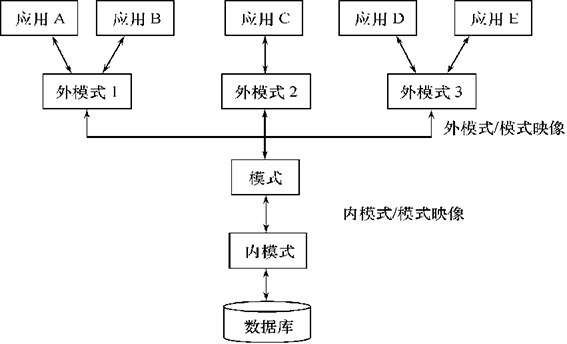

## 数据库在计算机系统中的位置

计算机核心软件之一，向下发挥算力，向上支撑应用。

## 基本概念

1. 数据（Data）：描述事物的符号记录，能被计算机处理的符号的总称，数据库中存储的基本对象，具有对应语义
2. 数据库（Database）：长期储存在计算机内、有组织的、可管理、可共享的相互关联的数据集合，数据间要求最小的冗余度和较高的独立性，其中数据库模型对数据库发展影响深远，主流的是关系模型（数据库设计问题）
3. 数据库管理系统（DBMS）：位于OS和APP之间数据管理的计算机程序集合，为数据库提供高效的数据组织、存储、查询以及DDL和DML用户接口，还有事务处理、并发处理、数据恢复、访问控制等内容（DBMS实现问题、数据库存取问题）

4. 数据库系统（DBS）：由数据库、数据库管理系统、开发工具及应用系统、数据库管理员及终端用户等组成的软件系统，用于管理和操作大量数据

5. 三级模式结构+两级映像：三级模式结构和两级映像通过提供不同层次的抽象和映射关系，有效地保护了数据库的逻辑独立性和物理独立性。逻辑独立性使得可以在不影响用户视图和应用程序的情况下修改逻辑结构，物理独立性使得可以在不影响逻辑结构的情况下修改物理存储方式

## 关系模型

1. 数据库模式（Schema）：数据库中全体数据的逻辑结构和特征的描述
3. 数据模型：现实世界实体、实体间联系以及数据语义和一致性约束的模型，包括数据结构（关系）、数据操作（关系代数）和数据约束（实体完整性、参照完整性、用户自定义完整性）

> 关于数据库系统概论，包括：
>
> - 关系数据库
> - SQL
> - 范式
> - 数据库设计
> - …
>
> `biglonglong`秉承”不重复造轮子“的原则，不再赘述，初学者推荐：
>
> - [王珊,萨师煊.数据库系统概论(第5版)[J].中国大学教学, 2018, No.333(05):100.DOI:CNKI:SUN:JXCY.0.2018-05-024.](http://chinadb.ruc.edu.cn/second/url/2)
> - [赵亮 (2021). 《数据库系统概论》[在线视频]. 圣才教育](https://www.bilibili.com/video/BV1W3411y7dw/?vd_source=1a278fe24f00dd5c69f2875b5add5a19)
>
> 下面仅考虑DBMS实现问题，尤其是存取效率这块，包括数据存储、数据表述、缓冲区管理、索引结构、查询处理、事务处理…

