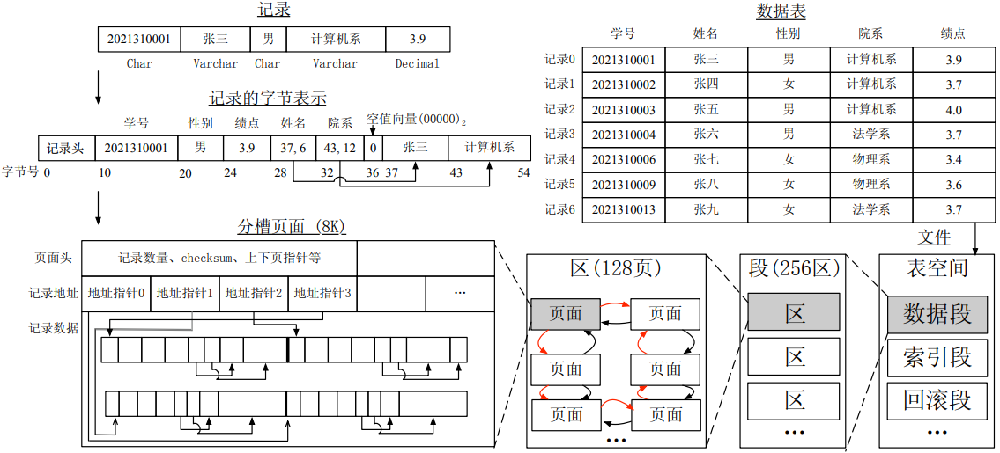
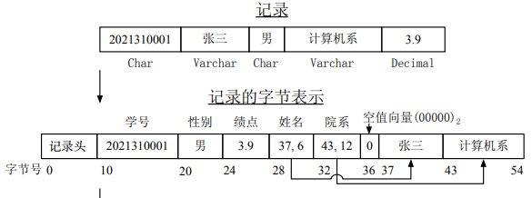
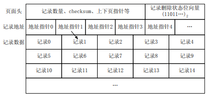
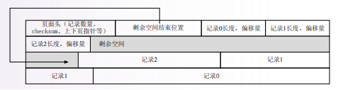

> 如何组织数据？保证数据组织的灵活性、复杂程度、空间利用率，减少磁盘I/O次数

## 存储部分中的数据组织



数据表空间中数据段、索引段、回滚段分别存储，一次申请一个区，让相邻页的物理位置页相邻，方便顺序I/O

- 扇区：磁盘存储设备上的最小物理存储单位，通常是512B
- 块：文件系统将文件以块为单位存储，并将这些块映射到磁盘上的扇区，通过磁盘控制器进行物理读写
- 页：操作系统将进程的虚拟地址空间划分为多个页，并通过内存管理单元将这些页映射到物理内存或磁盘上的块


## 数据项表示

字节序列，通过SQL数据类型表示

| 类型         | 表示方法                                                     |
| ------------ | ------------------------------------------------------------ |
| 整数、实数   | 字节串                                                       |
| 定长字符串   | n字节的填充字节串                                            |
| 变长字符串   | n+1字节的定长字符串<br/>NULL结尾字节串<br/>长度标注，NULL结尾字节串 |
| 枚举类型     | 字符串指针字节串、整数编码                                   |
| 日期、时间   | 某种格式的定长字符串、变长字符串、差值整数                   |
| 二进制位序列 | 长度标注比特串、字节串                                       |


## 数据项的记录组织



- 定长记录

  - 固定格式：所有记录具有相同的逻辑结构

    ```sql
    CREATE TABLE Student(
        stid CHAR(30) PRIMARY KEY,
        stname VARCHAR(255),
        gender CHAR(1),
        birthdate DATE
    )
    ```

    - 记录首部：记录类型（模式信息指针）、记录长度、时间戳（用于并发控制）…
    - 属性值：要求与CPU总线宽度对齐

  - 可变格式：每个记录的格式不同，记录格式存储在记录中，以KEY-VALUE形成字节流

    ```sql
    typedef struct{
        void *data; //字节流指针
        int size; //字节流长度
    } DBT;
    ```

    - 更适合稀疏记录、可演变格式记录、处理重复字段
    - 标记存储方式空间代价高，查询不利，事务处理困难

- 变长记录

  - 首部指针法：变长字段在首部给出指针以标识位置，再将定长字段值在前，变长字段值在后
  - 混合格式：记录只包含首部、属性指针和属性长度，指针指向附加空间存储具体属性值


## 记录的块内（页面）组织

- 一般组织

  1. 定长记录：块内按槽划分，槽为固定大小，记录地址通过块头的<块号,槽号>表示，利于随机访问

     

  2. 变长记录：块头设置槽目录偏移量表，记录地址通过块头的槽目录<记录偏移量,长度>表示，利于删除

     

     - 混合格式：定长部分存储在某一块内，变长部分存储在另一块内

- 附加组织
  - 跨块：记录大小>块大小|空间资源拮据
  - 聚簇：提升簇键查询、表连接操作效率
    - 多关系存储：经常一起访问的记录存储在同一或连续块内（外码）
    - 单关系存储：将记录按照某一字段顺序排列在块内（主码）
  - NULL位图：记录了记录行数据的NULL值分布
  
- 记录修改

  - 插入：找到块内应该放入的位置，或者申请新块插入
  - 删除：删除记录并调整其他记录位置，或者加入空闲位置链表，或者使用删除标记（置空偏移量表|置空物理地址|首部位图）并标记可用空间


## 块的文件组织

- 堆文件：记录不以任何顺序排序，将记录简单地排列在文件中，插入容易但索引代价高
- 链表式堆文件组织：记录按某个字段大小顺序存储，对应的需要顺序插入和索引
- 目录式堆文件组织：多级分类组织，数据更新复杂但索引代价低


## SQL Server

### 页面组织

- 数据存储基本单位是页（8KB），页地址：<文件号,页号>，数据行地址：<页地址,槽号>
- 数据库文件是对象的集合，对象通过扩展盘区（8个邻接页）存储
  - 混合扩展盘区：最多可由8个对象共享（即1个对象至少占1页）
  - 统一扩展盘区：8页由单个对象所有
  - 通常从混合扩展盘区中向对象分配页，当对象增长到8页，即成为统一扩展盘区
- 三种类型文件
  1. 主要数据文件(.mdf)：数据库起点，指向数据库中文件的其他部分
  2. 次要数据文件(.ndf)：扩展数据库容量，除主要数据文件的所有数据文件
  3. 日志文件(.ldf)：恢复数据库的日志信息

### 页面类型

1. 文件头：文件的元数据，如文件大小、文件 ID、文件增长设置

2. PFS页：记录扩展盘区的哪些页已分配或可用，一个PFS记录约8,000页，对每页都有1B的位图

3. GAM页：记录已分配的扩展盘区，一个GAM记录64000个扩展盘区，对每个扩展盘区都有1bit的位图

4. SGAM页：记录当前用作混合扩展盘区且至少有一个未使用的页，一个SGAM记录64000个混合扩展盘区，对每个扩展盘区都有1bit的位图

   > | 扩展盘区的当前使用情况           | GAM位设置 | SGAM位设置 |
   > | :------------------------------- | :-------- | :--------- |
   > | 可用，未使用                     | 1         | 0          |
   > | 统一扩展盘区或已满的混合扩展盘区 | 0         | 0          |
   > | 有可用页的混合扩展盘区           | 0         | 1          |
   >
   > 1. 若要分配统一扩展盘区，搜索GAM为1的扩展盘区，分配其全部页给该对象，然后GAM设置为0
   > 2. 若要分配混合扩展盘区，首先搜索SGAM为1的扩展盘区，并根据PFS来搜索可用分配页，然后根据使用情况来设置SGAM位（可能不变，也可能设置为0）；如果没有合适的SGAM为1的扩展盘区，则搜索GAM为1的扩展盘区分配，然后GAM设置为0，SGAM设置为1
   > 3. 若要释放扩展盘区，则直接确保该扩展盘区GAM为1，SGAM为0

5. 索引分配映射表（IAM）：每个 IAM 页可以跟踪和管理某表或索引的一个分配单元的页分配情况（位图实现）

   - 当需要插入新行时，IAM用于检查该对象的扩展盘区分配情况，使用PFS查看扩展盘区的页分配情况

   - 数据页没有特定顺序，其逻辑链接记录在IAM中，使用IAM实现数据页集合
   - 某表或索引的多个分配单元使用IAM的链式结构跟踪

6. `sysindexes` 视图：包含了每个表和索引的元数据，如`firstIAM`，是该表或索引第一个IAM页ID|如`first`，是该表或索引的第一个数据页ID|如`minlen`，是记录行结构的最小长度（不包括NULL值和变长部分及列数属性）

7. 数据页：存储表或索引的真实块数据

