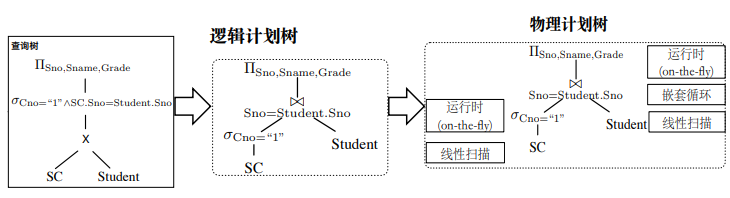

> 将用户提交的查询转换为高效的执行计划

## 工作流程


- 词法分析：提取出SQL查询语句中的关键词、常量等token
- 语法分析：依据词法分析提取token对应的原子节点，按照语法规则识别出语法类节点，构建为语法分析树
- 语义分析：检查语法分析树关于实际数据的语义正确性，并将其转化为基于关系代数表达的查询树，即初始逻辑查询计划


- 逻辑优化：基于代数转换规则（查询重写），找出等价但执行效率更高的关系代数表达式
- 代价估计：转换实际物理执行计划时，预测各物理执行计划的资源消耗大小
- 物理优化：枚举各种物理执行计划（连接算子、排序算子、选择算子），依赖代价估计器估计的各物理执行计划的代价，从中选取资源消耗最小的物理执行计划



- 查询执行：包括执行模型、编译技术、并行技术、缓存重用来提升执行效率。使用查询执行模型将物理执行计划编译为可执行代码，调用数据访问接口以返回结果


同一查询可以转化为多个逻辑等价的执行计划，不同逻辑执行计划执行效率不同，同一逻辑算子存在不同物理实现，不同场景下的不同物理实现效率不同，因此，查询优化很必要，如下：


## 查询重写

通过调整关系代数运算顺序（转换规则）来**最小化**每步运算**要处理的元组大小**

- 交、并、笛卡尔积、自然连接的交换律和结合律

  | 交换律                      | 结合律                                              |
  | --------------------------- | --------------------------------------------------- |
  | $R \cap S = S \cap R$       | $(R \cap S) \cap T = R \cap (S \cap T)$             |
  | $R \cup S = S \cup R$       | $(R \cup S) \cup T = R \cup (S \cup T)$             |
  | $R \times S = S \times R$   | $(R \times S) \times T = R \times (S \times T)$     |
  | $R \bowtie S = S \bowtie R$ | $(R \bowtie S) \bowtie T = R \bowtie (S \bowtie T)$ |

- 选择运算（+自然连接 –> 下推谓词）

  | 选择运算                                                     |
  | ------------------------------------------------------------ |
  | $\sigma_{C_1 \and C_2} (R) = \sigma_{C_1}(\sigma_{C_2}(R))$  |
  | $\sigma_{C_1 \or C_2} (R) = \sigma_{C_1}(R) \cup \sigma_{C_2}(R)$ |
  | $\sigma_p(R \bowtie S) = \sigma_p(R) \bowtie S$ （P为仅R的谓词） |
  
- 投影运算（尽早投影）

  | 投影运算                                                     |
  | ------------------------------------------------------------ |
  | $\pi_{xy}(R \bowtie S) = \pi_{xy}(\pi_{xz}(R) \bowtie \pi_{yz}(S))$（x为仅R属性，y为仅S属性，z为R&S共性） |

…


## 代价估计

影响因素：逻辑查询计划、中间结果大小、物理操作符、操作顺序、参数传递方式

### 中间结果的大小估计

计算中间逻辑执行计划结果的下列值，供”最优“执行计划的选择做出参考：

- $T(R)$：R的元组数
- $S(R)$：R中每个元组的大小
- $V(R, A)$：R中属性A的不同值数
- $B(R)$：容纳R所有元组所需块数

> | 关系代数            | T                                                            | S                         |
> | ------------------- | ------------------------------------------------------------ | ------------------------- |
> | $W = R1 \times R2$  | $T(W)=T(R1) * T(R2)$                                         | $S(W)=S(R1) + S(R2)$      |
> | $W=\sigma_{A?a}(R)$ | 假设属性均匀分布，$T(W)=选中率*T(R)$                         | $S(W)=S(R)$               |
> | $W=R1 \bowtie R2$   | 假设属性均匀分布，A为共性，$T(W)=\frac{T(R1)*T(R2)}{max(V(R1,A),V(R2,A))}$ | $S(W)=S(R1) + S(R2)-S(A)$ |
> | …                   |                                                              |                           |
>
> | 关系代数          | V                                                            |
> | ----------------- | ------------------------------------------------------------ |
> | $W=R1 \bowtie R2$ | 假设属性均匀分布，A为共性，$V(W,A)=min(V(R1,A),V(R2,A)$，$V(W,OTHER)V(R1/R2,OTHER)$ |
>
> 注意：在没有共性的情况下，自然连接退化为笛卡尔积，这是由SQL语句定义的
>
> ```sql
> select 共性、非共性 from R,S where 共性一致
> ```

### I/O代价估计

在某种物理操作符和操作顺序以及参数传递方式的情况下，计算物理执行计划所必须的读/写磁盘块数目，形成候选物理执行计划：

- $B(R)$：容纳R所有元组所需块数
- $f(R)$：每块可容纳R的最大元组数
- $M$：可用内存块数
- $HT(i)$：索引i层数
- $LB(i)$：索引i的叶节点所需块数


## 物理执行计划选择

确定逻辑操作符的物理操作符、其他物理操作符（表扫描、排序扫描、索引扫描），确定物理操作符顺序，确定物理操作之间的参数传递方式，取最小代价的物理执行计划

### 连接操作符实现

> 影响因素：关系元组是否在磁盘块中连续存放？关系是否按连接属性有序？连接属性上是否存在索引？
>

1. 嵌套循环连接

   ```sql
   for r in R
   	for s in S
   		if r.C==s.C is true
   			add((r,s), res)
   ```

   考虑元组在磁盘块内连续且无序的情况，M-1块内存空间用于T较小的关系R，剩余1块内存空间用于另一T较大的关系S，每次读入关系R中的M-1块元组，剩余1块内存空间依次读入关系S中的所有元组块，并与关系R进行连接操作，重复上述过程直到关系R的元组块全部读入过为止。
   $$
   Cost=\frac{B(R)}{M-1}(M-1 + B(S))
   $$

2. 归并连接

   ```sql
   sort(R);sort(S)
   while(i<=T(R) && j<=T(S))
   	while R[i].C==S[j].C checkMore(i, jj<-j)
   	else if R[i].C>S[j].C j++
   	else if R[i].C<S[j].C i++
   ```

   考虑元组在磁盘块内连续且无序的情况，首先分别对关系R和S进行两阶段多路归并排序（将关系内所有元组以M块为单位读入并排序，再以M大小的大块写回；依次读入多个有序大块的最小块，归并为有序文件写回），再对两有序关系进行归并匹配。

   - 两阶段多路归并排序第二阶段归并操作要求每个关系的大块总数都不大于内存大小。
   - 两阶段多路归并排序第二阶段归并操作可与最后连接操作同时在内存中完成，此时每个元组只要进行3次IO，但要求两关系的大块总数不大于内存大小。

   $$
   Cost=5(B(R)+B(S))， 其中，\\
   B(R)/M<=M \\ 
   B(S)/M<=M
   $$

   - 嵌套循环连接是二次算法，而归并连接是一次算法，当关系较小时，嵌套循环连接IO更小，反之归并连接更小

3. 索引连接

   ```sql
   for r in R
   	X <- index(S,C,R.C)
   	for s in X
   		add((r,s), res)
   ```

   考虑元组在磁盘块内连续且无序、连接属性存在索引且索引在内存中的情况，遍历关系R的元组块，并以连接属性和索引匹配关系S的元组，读入匹配元组并连接
   $$
   Cost=B(R)+T(R)*p\\
   p为每个R对应的S的个数，即基数
   $$

4. 散列连接

   

   考虑元组在磁盘块内连续且无序的情况，划分阶段：M-1块对应M-1个桶，剩余1块依次读入关系的元组，计算元组哈希值并将元组写回到对应的桶中，探查阶段：每次读入T较小的关系R的一个桶，通过哈希值依次读入T较大的关系S的对应桶的每一块。
   
   - 每个桶对应B(R)/(M-1)块，为保证探查阶段，桶大小+1不大于内存块数
   
   $$
   Cost=3(B(R)+B(S))\\
   B(R)/(M-1)+1<=M 或者 B(S)/(M-1)+1<=M
   $$

> 
>
> - 嵌套循环连接适合相对内存较小的关系
> - 归并排序适合有序关系或者非等值连接
> - 索引连接适合存在索引时
> - 常规的等值连接适合散列连接

### 连接顺序选择

#### 物理IO代价导致

假设连接时总是先将左变元R1读入内存，然后一次一块地读入R2做连接

- 嵌套循环连接：较小的关系作为左变元
- 归并连接：排序之后较小的关系作为左变元
- 索引连接：有索引的关系作为右变元
- 散列连接：较小的关系作为左变元


### 参数传递方式

1. 流水线：多个操作同时执行，一个操作产生的元组直接通过共享内存传递给其他操作
   1. 节省IO
   2. 占用主存，若缓冲区出现“颠簸”则IO增加
2. 物化：操作依次执行，并且每个操作的结果（中间关系）都写到磁盘上共其他操作存取
   1. 通过磁盘物理进行数据传递
   2. 节省主存空间

 