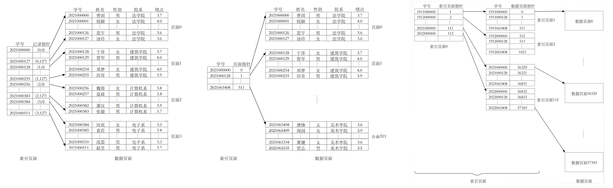
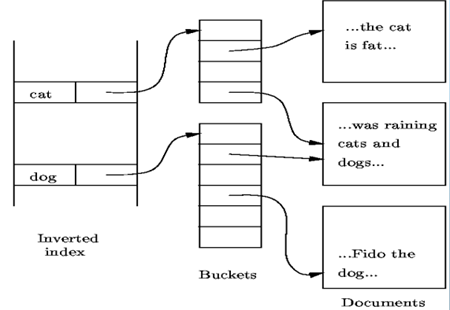
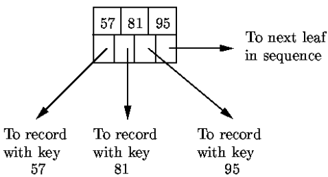
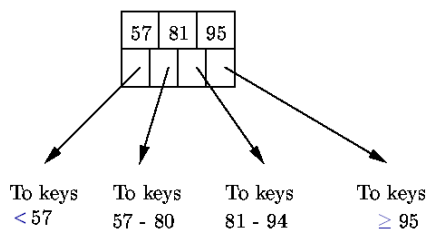
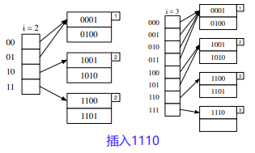
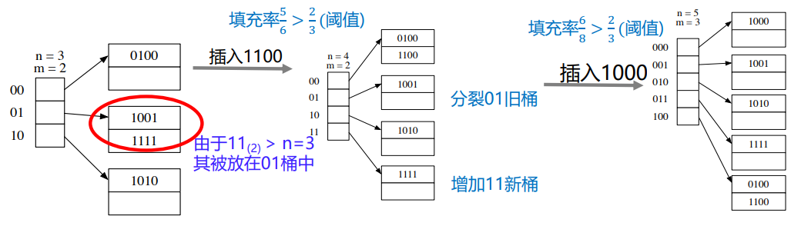
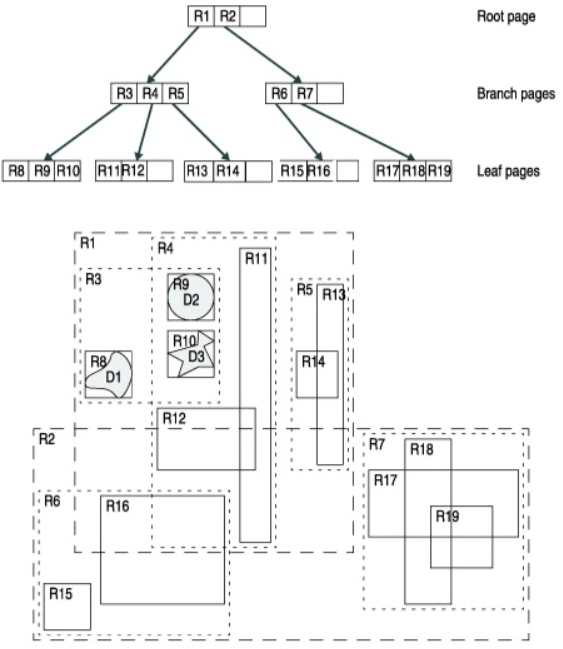
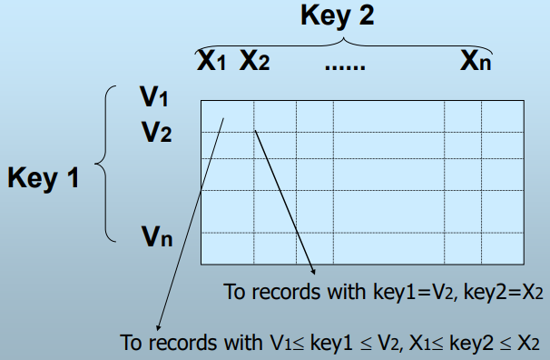
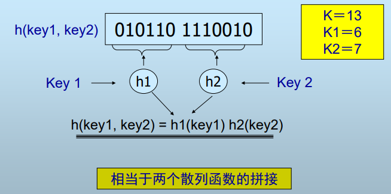

> 为了提高按查找键查找的数据查询效率，构建了索引，使记录请求快速定位到页地址，减少磁盘I/O次数
>
> - 索引项：由查找键和指向记录地址的指针构成，多个索引项以一定的数据结构形成索引目录，分配到多个索引块中
> - 索引块：由索引项构成，索引项要比记录小得多，因此单个索引块可定位多个数据块，从而常驻内存快速定位数据块，减少磁盘I/O次数
> - 查询：读入索引块，根据查找键和索引结构，得到下一级索引块或数据块的指针，继续读入指针指向块，以此类推，直到读入数据块为止
> - 磁盘I/O次数：索引块I/O次数（目的是定位记录索引块）和 数据块I/O一次
>
> 下面讨论索引结构以快速定位记录索引块？

## 线性

>  顺序结构；索引项按查找键排序，查询时对全部索引块线性查找、二分查找等；通常磁盘I/O代价与算法有关

1. 密集索引：每个记录都有一个索引项
   - 优点：查找记录是否存在时，无需读入磁盘上的数据块
   - 缺点：索引密集，空间占用大，难以常驻内存
   - 使用场景：记录在块内按查找键（其他不唯一属性）无序 –  ==辅助索引==
     - 属性值不唯一，导致查找键对应记录不唯一，存在多条记录查找键重复的问题 – 间接桶
       1. 辅助索引中，每个索引项包含查找键和指向间接桶的指针
       2. 间接桶介于辅助索引和记录之间，存储同一查找键的不同记录指针，用于更细致地区分同一查找键的记录
2. 稀疏索引：通常为每个数据块（块首记录）建立索引，**块内记录要求顺序**
   - 优点：索引项更少，节省了索引空间，利于常驻内存
   - 缺点：查找记录是否存在时，需要读入磁盘上的数据块
   - 使用场景：记录在块内按查找键（主键、唯一键）有序 – ==主索引==
3. 多级索引：一级索引块向上再建二级索引块…，索引向上逐级稀疏

   - 优点：一级索引空间占用过大而二级索引可常驻内存，减少磁盘I/O，且分层结构更利于快速定位
   - 缺点：结构复杂，操作复杂
   - 使用场景：记录在块内按查找键无序，且记录量大，索引太密集 – 对辅助索引建立二级索引稀疏化
   

> 关于查询时磁盘I/O，假设：
>
> 一块4KB，一级索引10000个块，二级索引100个块，每个块可存100个索引项，即每个二级稀疏索引项对应上一个一级索引块
>
> 因此：
>
> 若按一级索引二分查找，平均需要lg10000次I/O定位一级索引块，再从中找到数据块指针，最后进行一次数据块I/O；
>
> 若按二级索引查找，让二级索引提前预置在内存中，直接得到一级索引块指针，一次一级索引块I/O，以此得到数据块指针，再进行一次数据块I/O

> 一种辅助索引间接桶思想—文档查词检索的==倒排索引==，其组成为：
>
> 
>
> - 词汇表：所有在文档集合中出现的唯一词汇（唯一性是在分词后去重得到）
> - 倒排列表（间接桶）：每个词汇对应一个倒排列表，包含所有包含该词汇的文档指针
> - 列表扩充：对每个词汇的倒排列表内，根据词汇标签（title、header、text…）进一步定位文档
>
> 其构建过程：
>
> 1. 文档预处理：对文档进行分词、去停用词、词干提取等预处理操作。
> 2. 词汇表构建：将所有词汇添加到词汇表中。
> 3. 倒排列表构建：为每个词汇创建倒排列表，记录包含该词汇的文档ID、词频、词位置信息和列表扩充等

## B+树

> 树形多级索引结构；索引项按平衡树型排布，查询时逐层向下，记录范围逐层缩小；通常每个节点分配为一个块大小，树高3层，根节点常驻内存，因此磁盘I/O代价不超过2（总代价不超过3）

- 所有节点格式相同：n个值，n+1个指针，其中：
  - 叶子节点，所有叶子节点位于同一层,用于存储数据指针
    
    
    
    - n对查找键-指针对
    - 1个指向相邻叶节点的指针，组成单向链表
    - 至少$\lfloor \frac{n+1}{2} \rfloor$个指针指向索引记录
    
  - 非叶子节点，用于存储稀疏索引
    
    
    
    - n个查找键划分出n+1个子树，对应指向n+1个区间的指针
    - 第i个查找键是第i+1个子树中的最小查找键边界（左闭右开）
    - 根节点至少2个指针，至少$\lceil \frac{n+1}{2} \rceil$个指针指向查找键

### 操作

- 查找：从根节点开始，按查找键划分区间逐层向下，直到找到包含查找键的叶子节点，再在叶子节点中按顺序精确查找
- 插入：查找要插入键值对所在叶子节点，插入键值对，超容节点分裂，继续递归向上分裂
  - 叶子节点分裂：将叶子节点内键值对均分为两个节点，并插入两节点在父节点中的索引边界（注意左闭右开）
  - 中间节点分裂：将中间节点内键值对均分为两个节点，并将边界节点移动到父节点中
  - 根节点分裂：将节点内键值对均划分为两个节点，并以边界创建一个新的根节点
- 删除：查找删除键值对所在叶子节点，删除键值对，节点填充度不足补充并调整父节点边界，继续递归向上分裂
  1. 借用：若相邻叶子节点中键数量大于规定值，则移动一个键值对到该节点
  2. 合并：若相邻叶子节点中键数量等于规定值，合并两节点，视作父节点删除一个子节点

### 其他版本

- B树：所有节点都存储实际数据，依旧保持B+树的平衡及搜索特性；无重复键值，搜索可能在非叶子节点结束，减少了磁盘I/O；不适合范围查找
- Overflow B+ tree：叶子节点引入溢出链表，减少了频繁的节点分裂和合并操作，从而提高插入和删除操作的性能，但破坏了B+树的平衡结构，大大降低了读性能
- BloomTree：非叶子节点引入Bloom Filter，提前判断查询元素是否可能在子节点中，提高了读写性能

> 关于B+树的空间效率，假设B+树单个节点以块来存储，块大小8KB，键和指针都是2B，则1个索引4B空间，1块可放2^11^个索引项，因此：
>
> 若层数为1（1个节点），索引空间8KB，索引记录2047个（其中1个多余的2B指针，用于形成链表）
>
> 若层数为2（1+2^11^个节点），索引空间约16MB（(1+2^11^) * 8KB），索引记录约419万个（2048*2047）
>
> 若层数为3（1+2^11^+2^22^个节点），索引空间约32GB（(1+2^11^+2^22^) * 8KB），索引记录约85亿个（2048 * 2048 * 2047）

## 散列表

> 查找键-散列函数->记录地址结构；构建查找键与记录地址之间的映射，查询时将查找键经散列函数直接定位到记录所在桶，从桶中查找记录所在块；通常每个桶分配为B个块，因此磁盘I/O代价为B

### 操作

- 查找：根据查找键和散列函数定位到桶，从桶中查找数据块
- 插入：根据查找键和散列函数定位到桶，插入桶中空间或桶对应溢出块
- 删除：根据查找键和散列函数定位到桶，删除桶中记录或其对应溢出块，可能调整桶中记录次序（如溢出块，前向空缺）

问题在于记录插入后的非均匀分布问题（有些桶空，有些桶过量溢出），出现空间利用率（实际键值数/所有桶可放置的键值数）<50%时空间浪费，>80%时存在溢出（增长IO次数），因此，关键在于设计动态散列表：

### 动态散列表

#### 可扩展散列表

使用散列函数将查找键键映射到一个二进制位串，取串前i位对应全局目录，用于区分桶

1. 双重目录结构：一个全局目录和多个桶，全局目录存储指向桶的指针，桶存储实际记录
2. 全局深度：全局目录的二进制长度，即当前i，决定了桶数目的上限，当出现某种溢出情况时`i++`以成倍扩展桶上限
3. 局部深度：每个桶都有局部深度，某个桶溢出使得局部深度自增进而导致全局深度自增，其他桶未溢出则局部深度保持不变（表现为局部深度长前缀相同的记录共用同一桶），直到该桶发生溢出时局部深度自增，将该桶中记录用更长的局部深度长前缀细分到两个新桶；当局部深度来到全局深度大小，全局目录对应桶数目已达上限，此时全局深度自增以成倍扩展桶上限

初始时，i=0，全局目录分为0和1，分别指向一个空桶；之后根据查找键对应二进制串前i位和全局目录向桶中填充数据，操作如下：

- 桶未满，直接插入记录
- 桶已满，检查桶的局部深度和全局深度。
  - 局部深度小于全局深度：分裂桶（增加局部深度，将数据重新分配到两个新桶中），更新全局目录。
  - 局部深度等于全局深度：分裂桶（增加局部深度，将数据重新分配到两个新桶中），扩展全局目录（增加全局深度），更新全局目录。

#### 线性散列表

使用散列函数将查找键键映射到一个二进制位串，取串后i位用于区分桶，i=$\lfloor log_2桶数\rfloor$

1. 插入桶：当串后i位无法定位唯一桶时，则用串后i+1位定位，桶满则插入桶溢出块
2. 分裂桶：当插入桶的填充度（当前桶数/当前记录总数）超过某个固定比例分裂桶（加入新桶），重新编号桶，将新桶对应原桶中的记录重新分配到两个桶中

初始时，i=0，2个空桶，分别编号0和1；之后根据查找键对应二进制串后i位/后i+1位插入桶中即可；当填充度超过固定比例时加入新桶并重新编号和分配对应桶记录，如新桶10对应原桶0，即00

## 以上一维索引结构对比

| 特征         | B+树                   | 散列表               |
| :----------- | :--------------------- | :------------------- |
| 结构稳定性   | 高度平衡，稳定         | 受溢出块影响，不稳定 |
| 范围查询     | 基于比较，支持         | 函数定位，不支持     |
| 查找IO代价   | 树高为d，代价则d+1     | 总块数/桶数          |
| 额外空间代价 | 多级索引，存在冗余，高 | 低                   |
| 更新索引代价 | 涉及节点的分裂合并，高 | 低                   |

可扩展散列不存在溢出块，查找时对应一个桶（一个块），但桶增长速度快，可能导致内存放不下整个桶数组，影响其他保存在主存中的数据，波动较大；线性散列空间效率更高，桶分裂时机更灵活合理，综合性能较好，但实现复杂，查找性能较差

## 多维索引

### R-Tree

类似于B树，从最小不可分空间（最小限定矩形、叶子节点、实际记录）开始，逐层向上就近聚类，直到聚集为根节点，同样基于磁盘按节点分页存储，下面是R-Tree在2-dim的一个实例：

- 查找：递归向下查找与搜索矩形有重合的子节点，直到叶子节点，返回叶子节点其中记录条目
- 插入：为记录找到合适插入的叶子节点，对叶子节点进行更新
  - 叶子节点有存储空间，且记录在叶子节点空间范围内，直接向叶子节点插入新记录
  - 叶子节点有存储空间，但记录仅与叶子节点空间范围有重合，对叶子节点递归向上进行空间范围扩张，再向叶子节点插入新记录
  - 叶子节点没有存储空间，对节点分裂，并递归向上传递这种分裂，调整各级限定矩形边界
- 删除：将记录从叶子节点中删除，根据叶子节点的情况，进行合并、借用、重新插入等压缩操作

### 网格文件

每个维度都有一个线性尺度，用于将数据空间划分为网格单元；

每个维度聚簇组织，不同维度分属不同块；

多维度属性值重复用桶区分；

适合分布均匀的二维数据的多键值查找、范围查找，但多维会导致网格指数级增长，易出现过多空桶

### 分段散列函数

对多个属性进行散列，产生一个二进制序列，其中每个属性各使用若干位；

适合多维数据的部分匹配查找，不适合范围查找，相比而言，可以将数据较均匀的散列到桶中，空间利用率高
