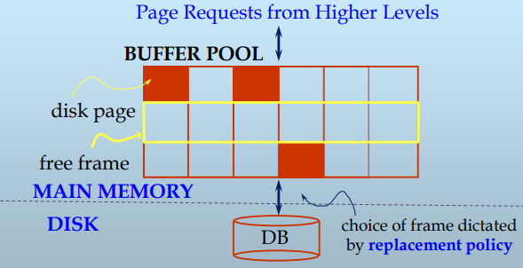

> 利用局部性，保持被请求块尽可能在缓存中，最小化磁盘I/O代价

## 结构



- 介于内存和磁盘之间，通过置换算法形成存储层次结构
- 由一个个Frame构成，一般每个Frame可容纳一个块
- Frame的参数—供替换算法参考
  - Dirty：Frame中的块是否已经被修改
  - Pin-count：Frame的块的已经被请求且还未释放的计数，即当前的用户数
  - Latch: 是否加锁
  - …

当上级存储结构发出块请求时，优先检查请求块是否在缓冲区，true则直接返回Frame，否则从磁盘上读取该块，并进行缓冲区替换（选择一个用于替换的Frame，要求pin-count=0，如果Frame是dirty的，则先将Frame的内容写回磁盘，最后将请求块写入被选择的Frame，且该Frame的pin-count自增1），返回该Frame。

当上级存储结构要求块释放时，将请求块对应Frame的pin-count自减1，并声明该块是否被修改过（dirty位）


## 替换策略

> Q: DBMS为什么不适用OS缓冲区管理？
>
> A: DBMS经常能预测访问模式。可以使用更专门的缓冲区替换策略，有利于pre-fetch策略的有效使用。且DBMS需要强制写回磁盘能力，OS的缓冲写回一般通过记录写请求来实现（来自不同应用），实际的磁盘修改推迟，因此不能保证写顺序。

### OPT

原理：理论最佳|每次置换**以后永远用不到的页面**，如果没有则淘汰最久以后再用到的页面

优点：在实验中作为算法性能上界加以对比

问题：必须预先知道全部页面的访问序列

### LRU

原理：利用时间局部性|维护一个链表，每次访问的Frame排入表头，总是替换表尾**最近不被访问**的Frame

优点：适合多次重复请求同一页的场景，时间复杂度O(1)

问题：缓存污染（重复顺序扫描导致缓存经常不命中），未考虑访问频率，未考虑并发

### LRU-K

原理：访问次数达到K次以上尽量不置换|维护两个LRU链表（一个访问次数小于K，一个K以上），优先置换前一链表的Frame

优点：保证高频访问的Frame保存在Buffer中

缺点：需要额外记录访问次数，且效果好的K参数值不好确定

### 2Q

原理：访问次数小于K次不常被访问|维护一个FIFO链表–其中Frame访问次数小于K和一个LRU链表–其中Frame访问次数K以上，优先置换FIFO链表的Frame

### Second-Chance FIFO

原理：每个Frame有一次”自保“机会|维护一个FIFO链表，附加初始为0的位图；当FO页第一次被选中，置换为1并移动到FI端，只有位图为1的FO页才被选中替换

优点：保证了访问频率参数的作用，位图空间代价很低

缺点：置换时需要移动多个元素，理论性能比LRU差

### CLOCK

原理：将Second-Chance FIFO算法组织成环|环附加current指针，环内Frame附加初始为1的referenced位；置换页时，从curent指针开始遍历检查，直到Frame的pin-count为0，继续检查referenced位，为1则设置为0，继续遍历current，为0则置换该Frame。

优点：避免了置换时需要移动多个元素的代价

### SSD-CFLRU

原理：缓存分为工作区域（存储最近访问的数据）和清理区域（存储较少访问的数据），替换页优先级为清理区域clean pages > 清理区域dirty pages(要求先写回) ，从而减少对 SSD 的写操作

优点：减少SSD（读快写慢，写有限）写操作

缺点：需要动态调整工作区域和清理区域的大小，以优化性能；工作区域的Dirty Frame积累导致突发的大量写需求


## 缓冲区和存储器管理的关系

缓冲区是Frame的集合，磁盘是数据块的集合，即页的集合

- 读磁盘块：根据page_id 确定 Frame_id
- 写磁盘块：根据Frame_id 确定 page_id

因此，可以建立Frame-page之间的索引

```c
BCB hTable[BufferSize];		// page 2 Frame
int hTable[BufferSize];		// Frame 2 page
```

